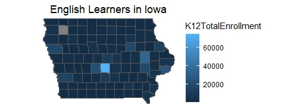
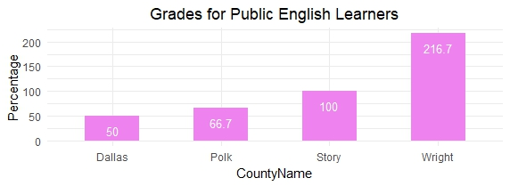
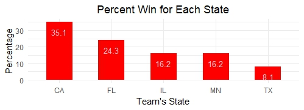

 # Assignment 2
 
This took a look at the 2022-2023 Iowa Public School K-12 English Learners (EL) by District and Grade. I ended up suing County names predominantly and some selected grades.

This map represents K-12 English Learners for selected grades in the State of Iowa, grouped on County basis. A excel file was used.

Experimented with Google sheets as well to create the chart below.

