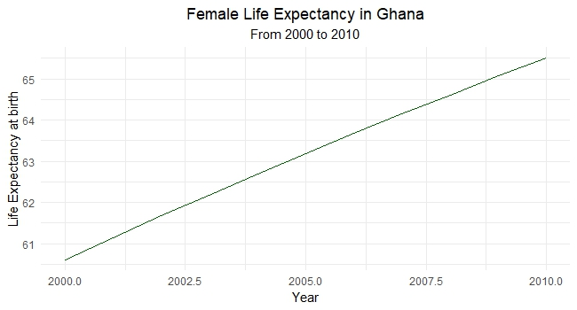
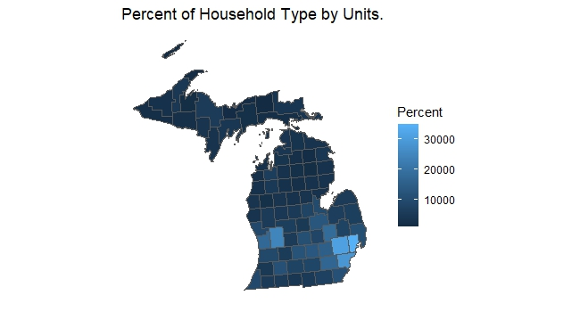
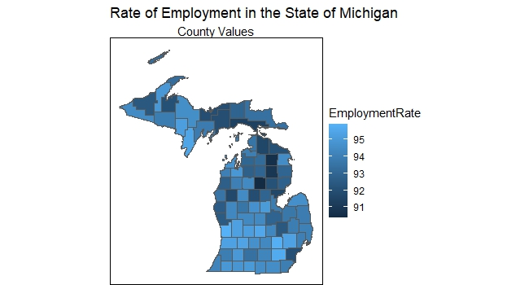

# Assignment 3

### Plot 1 

This represents Female Life Expectancy at birth. This line graph used data from Ghana. The IDBR package was used to generate the plot.

### Map 1

This is a map of the State of Michigan. Tidycensus was used to retrieve ACS 5-year data (2017-2021). The data chosen for the representation was Household Type by Units.

### Map 2

Gathered data from Michigan Department Technology, Management & Budget - Michigan Labour Market Information on Employment and Unemployment Statistics(2022). This made use of an excel file.

